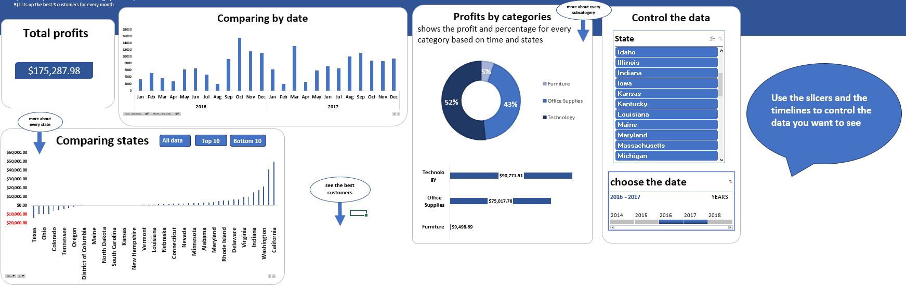
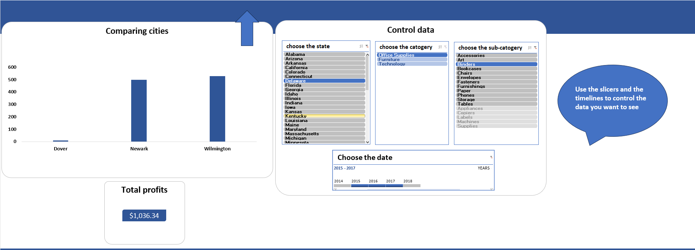
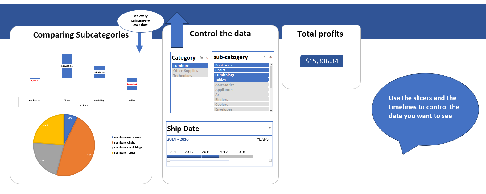
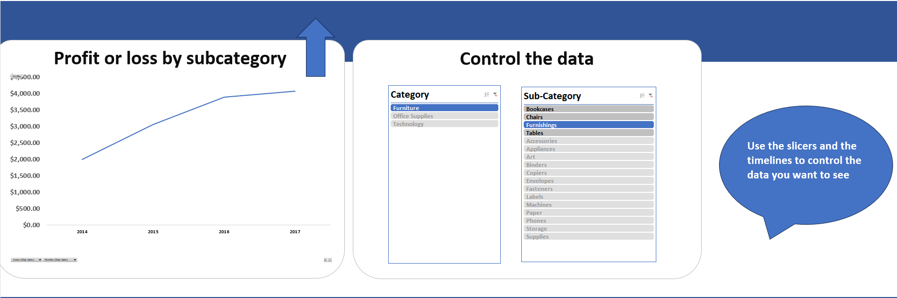
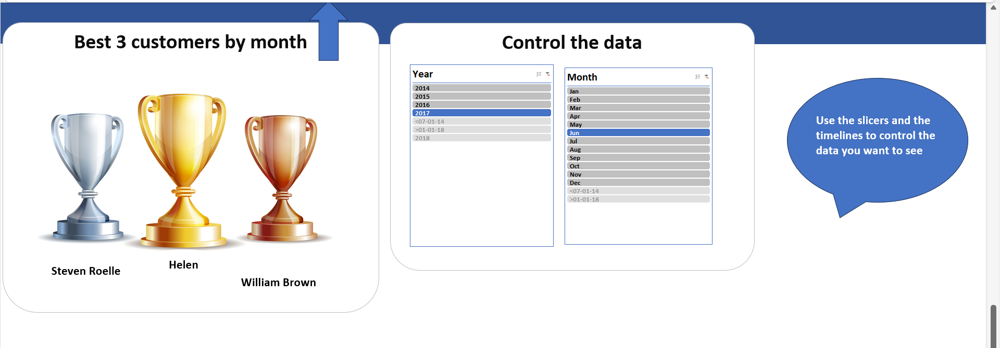

# Profits dynamic dashboard

link to the dataset used in the analysis : https://community.tableau.com/s/question/0D54T00000CWeX8SAL/sample-superstore-sales-excelxls

I performed basic cleaning and analysis on the data and then I made a dynamic dashboard that users can interact with using slicers, timelines and buttons(using marcos) to change the data being visualized according to the needs.

snapshots : 

